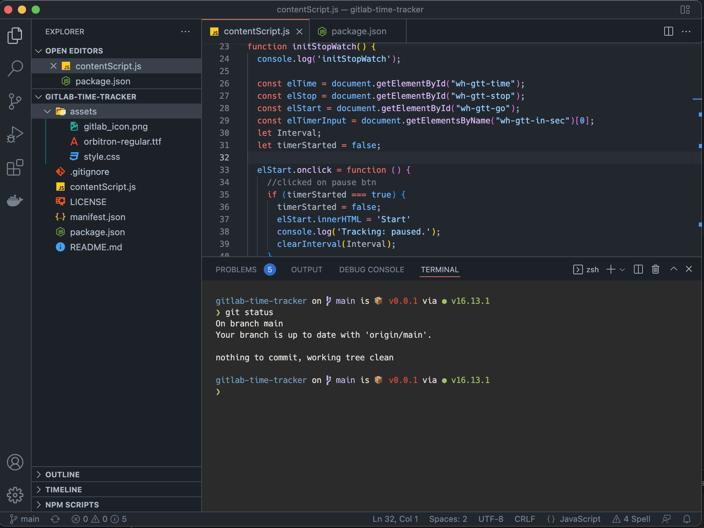

# "." files

Yeah, you read it right, **.**(dot) files. These files are hidden by default in your window explorer, but if you use them then they might come in handy for you. And also can increase your development productivity by 10-12%.
Seriously?
Yeah, that's what I feel like and I have observed it.

Now let's tell you the use case of all the different types of dotfiles that I have here.

## Prerequisite
- [git](https://git-scm.com/downloads)

[Optional] If you have or want to get a terminal like mine then this is required, else you can skip it.
- [Oh My ZSH!](https://ohmyz.sh/#install)
- [Spaceship Theme for Oh My ZSH](https://spaceship-prompt.sh/getting-started/)
- [Powerline fonts](https://github.com/powerline/fonts#quick-installation)

[Optional] If you are using VS Code and wants the look and file as I have then the following this are required.
- [Material Icon Theme](https://marketplace.visualstudio.com/items?itemName=PKief.material-icon-theme)
- [GitHub Theme](https://marketplace.visualstudio.com/items?itemName=GitHub.github-vscode-theme)



## Installation

Take a backup of existing files, so that if anything goes wrong then you can restore it from there. Also, it is a good practice to take a backup for further references.

```bash
cd ~/
mkdir backup-dotfiles
cp .bashrc ./backup-dotfiles/
cp .bash_profile ./backup-dotfiles/
cp .gitconfig ./backup-dotfiles/

# You can skip this if you are not using the Oh My ZSH terminal.
cp .zshrc ./backup-dotfiles/

# You can skip the following commends if you are not using the VS Code editor.
# for macOS
cp $HOME/Library/Application\ Support/Code/User/settings.json ./backup-dotfiles/

# for Linux
cp $HOME/.config/Code/User/settings.json ./backup-dotfiles/

```

Now you have to overwrite/copy all the files.

```bash
cd ~/

# cloning this repo
git clone https://github.com/finallyRaunak/dotfiles.git --depth=1

cp ./dotfiles/.alias ./
cp ./dotfiles/.bash_profile ./
cp ./dotfiles/.bashrc ./
cp ./dotfiles/.exports ./
cp ./dotfiles/.gitconfig ./

# You can skip this if you are not using the Oh My ZSH terminal.
cp ./dotfiles/.zshrc ./

# You can skip the following commends if you are not using the VS Code editor.
# for macOS
cp ./dotfiles/vscode-settings.json $HOME/Library/Application\ Support/Code/User/settings.json

# for Linux
cp ./dotfiles/vscode-settings.json $HOME/.config/Code/User/settings.json

```

**If you are using Oh My ZSH then you have to update `ZSH` path in `~/.zshrc` file.**

Open the file using any editor and update the path of `ZSH`

```bash
export ZSH="/Users/raunak/.oh-my-zsh"

# replace it with your user working dir

export ZSH="<PATH-TO-YOUR-USER-HOME-DIR>/.oh-my-zsh"
```


## Usage of other files

### `.php-cs-fixer.dist.php`
If you are building a PHP application or a package then it is always recommended to follow PSR guidelines to structure your code. To use it you first have to install [friendsofphp/php-cs-fixer](https://github.com/FriendsOfPHP/PHP-CS-Fixer) as a dev dependency.

In your `composer.json` write the following lines
```json
"scripts": {
    "lint": "./vendor/bin/php-cs-fixer fix -vvv --dry-run --show-progress=dots",
    "lint:fix": "./vendor/bin/php-cs-fixer fix -vvv --show-progress=dots"
},
"scripts-descriptions": {
    "lint": "Run the php-cs-fixer script and list all the errors, which voiles defined rules.",
    "lint:fix": "Run the php-cs-fixer script and auto fix all the errors, which voiles defined rules."
}
```

Once added, you can use a command like `composer run-script --timeout=0 lint` to check all the linting issues.

### `.eslintrc.js`
If you are building a NodeJS/Typescript project then you should have this file. It helps you better organise the coding structure and streamline all the contributors to follow the same coding pattern and naming convention.  
It uses one addons namely [eslint-plugin-unused-imports](https://www.npmjs.com/package/eslint-plugin-unused-imports) along with [eslint](https://www.npmjs.com/package/eslint). 

In your `package.json` write the following lines
```json
"scripts": {
  "lint": "eslint './**/*.{js,ts}' --quiet",
  "lint:fix": "eslint './**/*.{js,ts}' --quiet --fix",
  "lint:windows": "eslint ./**/*.{js,ts} --quiet",
  "lint:windows:fix": "eslint ./**/*.{js,ts} --quiet --fix"
}
```
Once added, you can use a command like `npm run lint` to check all the linting issues.

Please Note: _If you are building an app using ReactJS, etc, then you can also have a `.eslintrc.js` file but the rules might be different. (As I do not belong to that field so, I'm unable to provide the correct rules ATM)_

### `.prettierrc.js`
